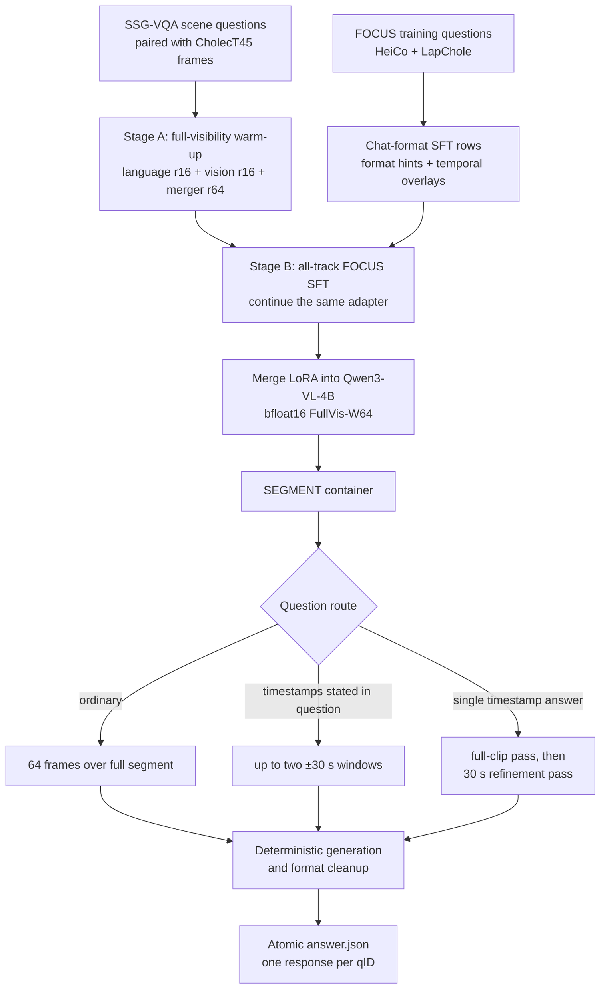

# DISCOVR-SEGMENT: detailed method description

> Draft for the ORena SAVE FOCUS 2026 method-description submission.
> Reconstructed on 8 September 2026 from the selected container, public model,
> training manifests, trainer states, run scripts, and artifact checksums.

## 1. Submission identification

| Field | Value |
|---|---|
| Team | Incision Impossible |
| Public method name | DISCOVR-SEGMENT |
| Track | SEGMENT |
| Grand Challenge algorithm | `DISCOVER SEGMENT T1` |
| Method ID | `8c0c5a0a-e147-486b-90c8-abbf0afeb624` |
| Selected image version | `b74f595d-06d4-488a-b76b-217544cf8e55` |
| Pre-evaluation ID | `0b0b5564-a3e2-43f3-aa8e-a34fc3e485c9` |
| Base model | `Qwen/Qwen3-VL-4B-Instruct` |
| Released checkpoint | FullVis-W64, merged bfloat16 |

The exact source release is
[`mdivyanshu97/orena-focus-segment`](https://github.com/mdivyanshu97/orena-focus-segment).
The exact merged weights are
[`Div97/orena-focus-segment-fullvis-w64`](https://huggingface.co/Div97/orena-focus-segment-fullvis-w64).

## 2. Abstract

DISCOVR-SEGMENT is a surgical-video visual-question-answering system for
foreign-object questions over short video segments. It uses a 4-billion-
parameter Qwen3-VL model adapted in two stages:

1. surgical scene-literacy warm-up on SSG-VQA/CholecT45, with LoRA applied to
   the language model, vision encoder, and vision-language merger; and
2. continued supervised fine-tuning on the official FOCUS training questions
   from the HeiCo and LapChole datasets across the FRAME, SEGMENT, and
   PROCEDURE tracks.

At inference time, the model is paired with deterministic answer-format
inference, absolute-time overlays, question-anchored temporal windows, and a
two-pass timestamp-refinement route. The model is fully local: the submitted
container uses no network service, external API, detector, retrieval index, or
human interaction.

## 3. System overview

## 4. Base model and adaptation

The base model is
[`Qwen/Qwen3-VL-4B-Instruct`](https://huggingface.co/Qwen/Qwen3-VL-4B-Instruct).
The base weights were loaded in bfloat16; this was conventional LoRA rather
than 4-bit QLoRA.

The selected FullVis adapter used:

| Component | LoRA sites | Rank |
|---|---|---:|
| Language self-attention | `q_proj`, `k_proj`, `v_proj`, `o_proj` | 16 |
| Language MLP | `gate_proj`, `up_proj`, `down_proj` | 16 |
| Vision blocks | `qkv`, `proj`, `linear_fc1`, `linear_fc2` | 16 |
| Visual merger and deep-stack mergers | merger modules matched by `.*merger.*` | 64 |

Shared LoRA settings were alpha 32, dropout 0.05, no bias adaptation, no DoRA,
and causal-language-model task mode. The vision and merger sites introduced in
Stage A remained trainable during Stage B because Stage B continued the same
adapter rather than attaching a new language-only adapter.

## 5. Training data

### 5.1 Official FOCUS training export

The final Stage-B manifest was `alltracks_train_v2_64f.jsonl`.

| Property | Value |
|---|---:|
| Rows | 34,290 |
| File size | 196,783,311 bytes |
| SHA-256 | `48f79a5ae40971a43c47bf8686d26280a0d24a2eecf0ce4e2de2f70020c177da` |
| MD5 | `4977ecd14092719ab797760de09f37b7` |
| HeiCo rows | 20,000 |
| LapChole rows | 14,290 |
| FRAME rows | 13,730 |
| SEGMENT rows | 13,680 |
| PROCEDURE rows | 6,880 |

Breakdown by dataset and track:

| Dataset | FRAME | SEGMENT | PROCEDURE | Total |
|---|---:|---:|---:|---:|
| HeiCo | 8,000 | 8,000 | 4,000 | 20,000 |
| LapChole | 5,730 | 5,680 | 2,880 | 14,290 |

The manifest referenced 20 HeiCo training videos and 72 LapChole training
videos overall. One LapChole video had no SEGMENT row in this historical
export, so SEGMENT itself covered 71 LapChole videos.

Answer-format distribution:

| Format | Rows |
|---|---:|
| Foreign-object class | 11,531 |
| Timestamp | 8,375 |
| Integer | 6,556 |
| Multiple choice | 3,146 |
| Binary | 2,791 |
| Open ended | 1,807 |
| Percentage | 84 |

The capability mix included object identification, spatial localization,
temporal localization, aggregation, instance matching, duration estimation,
event understanding, and complex reasoning. Training was joint across all
three tracks; the selected SEGMENT model was not trained on SEGMENT alone.

### 5.2 FOCUS row generation

Each official training question was converted into one multimodal chat record
containing:

- dataset, track, question ID, and source-video path;
- clip start and end times;
- a system prompt;
- the original question plus a mechanically selected output-format hint;
- the organizer-provided gold answer;
- answer format and primary capability;
- requested frame count; and
- whether an absolute-time overlay should be drawn.

No new human labels were created for the FOCUS questions. The conversion
reformatted the official training annotations for supervised instruction
tuning; it did not use test answers or pseudo-labels.

Frame budgets in the selected manifest were:

| Track | Frames per row |
|---|---:|
| FRAME | 1 |
| SEGMENT | 64 |
| PROCEDURE | 64 |

An overlay was enabled for timestamp answers and the temporal-localization,
duration-estimation, and temporal-ordering capabilities. This produced 8,732
overlay rows and 25,558 non-overlay rows.

The format hint required an exact representation where the evaluator uses a
strict parser, for example `yes`/`no`, a bare integer, a foreign-object class,
or `hh:mm:ss`. The training target remained the original gold answer.

The historical manifest carried two prompt snapshots: HeiCo rows used a
6,415-character system prompt with the then-current knowledge card, whereas
LapChole rows used a 3,043-character prompt without it. The deployed SEGMENT
container uses its own bundled 6,648-character prompt with the knowledge card
and current bundled definitions. This train/serve prompt difference is
reported as part of the actual selected provenance.

### 5.3 Frame extraction

Frames were sampled uniformly within the annotated interval. Inclusive frame
bounds were computed by rounding `time × FPS`, clamping to the video, and
placing up to the requested number of unique indices uniformly between the
bounds.

Images were downscaled with bilinear interpolation only when their longest
side exceeded 768 pixels. To avoid repeatedly opening large videos during
training, the sampled images were cached as JPEG files at quality 95. The cache
key included question ID, track, interval, frame count, and overlay state.

For temporal rows, an `hh:mm:ss` absolute-procedure-time clock was burned into
the upper-left corner in yellow with a black outline. The timestamp was
calculated from the source frame index and FPS, not from the beginning of a
trimmed clip.

### 5.4 Historical FOCUS snapshot note

The selected models were trained on the exact July 2026 manifest identified by
the hashes above. A later audit compared it with newer pinned dataset
revisions and found that 5.3% of rows had been replaced, remapped, or corrected
upstream. The audit found:

- zero rows sourced from an official test split;
- zero answer-format drift on joined rows;
- zero cross-track ID artifacts; and
- 39 historical LapChole targets containing `Unknown foreign object`, a label
  present in an older upstream revision and removed later.

Corrected manifests were built after this audit, but retrains on them were not
the checkpoints selected for the submitted SEGMENT image. This description
therefore reports the historical data actually used, not the later corrected
alternative.

### 5.5 SSG-VQA surgical scene-literacy corpus

Stage A used a locally generated manifest called
`ssgvqa_scene_train.jsonl`, built from
[SSG-VQA](https://github.com/camma-public/ssg-vqa) questions and matching
CholecT45 frame records.

| Property | Value |
|---|---:|
| Rows | 238,925 |
| Unique source videos | 45 |
| Unique video frames | 24,250 |
| Images per row | 1 |
| SHA-256 | `1a132e94c566daee827118868b0669683bf6084060ebc128e6d528c1ded7cf35` |

Question-type distribution:

| SSG-VQA type | Rows |
|---|---:|
| Spatial localization | 48,455 |
| Count | 48,029 |
| Existence | 48,025 |
| Component query | 47,890 |
| Presence | 46,526 |

Answer-format distribution was 142,824 open-ended, 48,072 binary, and 48,029
integer questions.

The builder:

1. indexed CholecT45 parquet rows by `(video_id, frame_id)`;
2. de-duplicated alternate `_clean`/`_old` annotation directories for the same
   base video;
3. retained count, component, existence, spatial, and presence questions;
4. limited each `(frame, question type)` cell to two questions;
5. discarded questions without a matching image rather than fabricating an
   image; and
6. retained the original scene answer, with only `true`/`false` normalized to
   `yes`/`no`.

This warm-up was intended to teach laparoscopic scene perception—anatomy,
instruments, spatial relations, existence, and counts—before specializing on
the FOCUS foreign-object vocabulary. It did not convert SSG-VQA answers into
FOCUS classes.

SSG-VQA is provided for non-commercial scientific research under CC
BY-NC-SA 4.0. Users of these weights remain responsible for complying with
the source dataset terms.

## 6. Training procedure

### 6.1 Stage A: full-visibility surgical warm-up

Stage A trained the language, vision, and merger LoRA sites on the SSG-VQA
manifest.

| Hyperparameter | Value |
|---|---|
| Dataset size supplied | 238,925 rows |
| Evaluation holdout | 1% row-random holdout |
| Effective training rows | 236,536 |
| Holdout split seed | 0 |
| Epochs | 1 |
| GPUs | 8 |
| Per-device batch | 1 |
| Gradient accumulation | 2 |
| Effective global batch | 16 |
| Optimizer steps | 14,784 |
| Learning rate | `1e-4` |
| Optimizer | fused AdamW |
| Scheduler | cosine |
| Warm-up ratio | 0.03 |
| Weight decay | 0 |
| Gradient clipping | 1.0 |
| Precision | bfloat16 |
| Gradient checkpointing | enabled |
| Seed | 42 |

The best recorded Stage-A evaluation loss was approximately 0.2291 at step
14,000. The final one-epoch adapter was used to initialize Stage B.

### 6.2 Stage B: joint FOCUS fine-tuning

Stage B continued the Stage-A adapter on the 34,290-row FOCUS manifest.

| Hyperparameter | Value |
|---|---|
| Evaluation holdout | 3% row-random holdout |
| Training rows | 33,262 |
| Evaluation rows | 1,028 |
| Holdout split seed | 0 |
| Epochs | 3 |
| GPUs | 8 |
| Per-device batch | 1 |
| Gradient accumulation | 2 |
| Effective global batch | 16 |
| Optimizer steps | 6,237 |
| Learning rate | `1e-4` |
| Optimizer | fused AdamW |
| Scheduler | cosine |
| Warm-up ratio | 0.03 |
| Weight decay | 0 |
| Gradient clipping | 1.0 |
| Precision | bfloat16 |
| Gradient checkpointing | enabled |
| Maximum frames | 64 |
| Maximum image side | 768 pixels |
| Seed | 42 |

The selected adapter completed step 6,237. The surviving handoff for the
selected FullVis-W64 run records its lowest evaluation loss as approximately
0.2667 at step 6,000.
Checkpoint selection for challenge use was ultimately based on answer accuracy
and route-level evaluation rather than training loss alone.

### 6.3 Objective and batching

The Qwen chat template was applied to the system message and the sequence of
sampled images followed by the question. Training labels were masked over:

- padding;
- the entire prompt;
- image placeholder tokens; and
- all other non-answer positions.

Cross-entropy was therefore computed only on gold answer tokens. Per-example
loss was the mean over supervised answer tokens, followed by a batch mean.
No capability reweighting, replay mixture, auxiliary digit loss, or 4-bit
quantization was used in the selected run.

For memory efficiency, the language-model head computed logits only for the
trailing span that could contain supervised answer tokens. This changes the
allocation size but not the answer-token objective.

### 6.4 Merge and released model

The final adapter was merged into the base model with
`peft.merge_and_unload` and saved in bfloat16.

| Artifact | SHA-256 |
|---|---|
| Merged `model.safetensors` | `622fd66547b2ad88f9fcf9c74a22450f44b4c88cef8fcf1a9b464de2a51dcff3` |
| Selected `inference.py` | `4eaa5da09e5563154d8c9f9d9515f7c470492d89446ed0d8ae35ca877078372d` |

The merged weight file is 8,875,719,408 bytes.

## 7. Inference

### 7.1 Input handling

For each question, the container reads the request metadata and the matching
plain trimmed video. It uses its bundled foreign-object definitions because
these match the deployed prompt. The platform-provided relative-time overlay
video is not used; the system redraws an absolute-time overlay on plain frames
when required.

The answer format is not present in the runtime request, so it is inferred
deterministically from the question text. The inferred format controls:

- the appended format instruction;
- whether temporal overlaying is enabled;
- the generation token limit; and
- output cleanup.

### 7.2 Frame routing

| Route | Model evidence |
|---|---|
| Ordinary question | 64 frames uniformly sampled over the complete segment |
| Explicit timestamps in a non-cascade question | Up to two question-anchored windows, each using a ±30-second half-width; the 64-frame budget is divided across windows |
| Single-timestamp question, pass 1 | 64 frames over the complete segment with absolute-time overlay |
| Single-timestamp question, pass 2 | 64 frames in a 30-second total window centered on the first predicted timestamp |
| Multi-event timestamp-list question | Question-window or full-clip route without collapsing to a single refinement center |

Question-window sampling is clamped to the available clip. The refinement pass
is accepted only if it returns a valid timestamp; otherwise the valid first
answer is retained.

### 7.3 Prompt and decoding

The deployed SEGMENT system prompt contains:

- a concise surgical VQA instruction;
- the bundled foreign-object definitions; and
- the selected surgical-safety knowledge card.

The knowledge card is static text, not retrieved information. Generation is
greedy and deterministic (`do_sample=False`). Ordinary questions are limited
to 32 new tokens. Mechanically recognized multi-timestamp questions may use up
to 128 tokens.

### 7.4 Output normalization

Post-processing extracts the strict answer representation required by the
challenge:

- binary: `yes` or `no`;
- integer: non-negative digits;
- percentage: numeric value;
- foreign-object class: canonical class name(s) or `none`;
- time: zero-padded `hh:mm:ss`;
- multiple choice: one supplied option; or
- concise text for semantically judged formats.

The cleaner preserves the model's first-mentioned order for multi-class
answers while canonicalizing class spelling.

### 7.5 Reliability

The model is loaded and warmed once per batch. Each question is isolated by its
own exception boundary. The output layer preserves request order, emits one
response per recoverable question ID, pads missing responses, and atomically
renames a temporary file to `/output/answer.json`.

A model-loading or GPU-setup failure is raised rather than disguised as a
successful batch of empty answers.

### 7.6 Container environment

The released `linux/amd64` image is based on
`pytorch/pytorch:2.11.0-cuda12.8-cudnn9-runtime`. Principal pinned runtime
packages are PyTorch 2.11.0, `orena-focus` 0.3.5, Transformers 5.4.0,
`qwen-vl-utils` 0.0.14, PEFT 0.19.1, Accelerate 1.14.0, and Safetensors
0.7.0. A build-time guard checks that the installed PyTorch remains a CUDA
12.8 build with the required GPU architectures.

## 8. Model and route selection

Model selection used paired local comparisons on official training/evaluation
interfaces and targeted route gates. The full-visibility warm start materially
improved the SEGMENT model relative to the earlier language-only warm start.
Question-window and timestamp-refinement routes were retained because they
improved the corresponding temporal subsets while remaining within the pooled
latency allowance.

Local development scores are not presented as hidden-test estimates. The
official pre-evaluation result below is the platform measurement for the
selected image.

## 9. Official pre-evaluation result

| Metric | Value |
|---|---:|
| Pre-evaluation score | 0.5656564985 |
| Questions | 2,000 |
| Batches | 4 |
| Questions forfeited | 0 |
| Questions unanswered | 0 |
| Mean batch duration | 2,685.7167 s |
| Mean net latency per question | 5.1314 s |
| Throughput including setup | 0.1862 questions/s |

Bucket accuracies:

| Capability | In distribution | Out of distribution |
|---|---:|---:|
| Aggregation | 0.6098 | 0.5000 |
| Complex reasoning | 0.6324 | 0.6444 |
| Object recognition | 0.6835 | 0.5039 |
| Temporal grounding | 0.6267 | 0.6402 |
| Event understanding | 0.5000 | 0.3158 |

## 10. Reproducibility and public artifacts

The repository publishes:

- exact selected inference source;
- Dockerfile and build/export scripts;
- a pinned weight downloader;
- SHA-256 verification;
- route modules and prompts;
- release provenance; and
- the detailed method description.

Raw challenge videos, patient data, and organizer annotations are not
redistributed. Reproduction requires legitimate access to the source datasets
under their original terms.

## 11. Limitations

- Uniform frame sampling can miss brief events between sampled frames.
- The training-loss holdouts were row-random, not video-disjoint, and were used
  for monitoring rather than unbiased generalization estimates.
- The selected FOCUS manifest predates later upstream label and ID corrections.
- The knowledge card may help reasoning questions but can also influence
  answers when visual evidence is weak.
- The system is a challenge research prototype, not a medical device or
  clinical decision-support system.

## 12. Licensing and data governance

- Repository code: Apache-2.0.
- Qwen3-VL base model: Apache-2.0.
- SSG-VQA: CC BY-NC-SA 4.0 for non-commercial scientific research.
- FOCUS, HeiCo, LapChole, CholecT45, and challenge assets: governed by their
  respective owners and access terms.

No credentials, raw patient videos, or private test annotations are included
in the public release.

## 13. Items to finalize before portal submission

- Add the final author list, affiliations, and corresponding contact.
- Add any method-description template fields or page limit supplied by the
  organizers.
- Confirm the deadline shown in the live Grand Challenge portal; the static
  challenge dates page and portal text have shown different September dates.
- Export this Markdown to PDF if the submission form requires a document
  upload.
