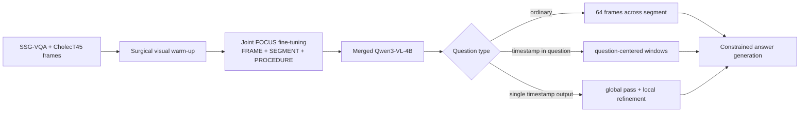

# DISCOVR-SEGMENT: scientific method description

## Abstract

DISCOVR-SEGMENT is a video question-answering method for identifying and
reasoning about foreign objects in short laparoscopic video segments. The
method was designed around two observations. First, a general-purpose
vision-language model requires explicit adaptation to laparoscopic appearance,
where small instruments and foreign objects occupy only a small fraction of
the image. Second, temporal questions are often limited by evidence selection:
uniformly sampling a video can leave no frame close to the event mentioned in
the question.

We therefore combine a two-stage visual-language adaptation procedure with a
deterministic temporal evidence policy. A Qwen3-VL-4B model is first adapted to
surgical scene understanding using SSG-VQA questions paired with CholecT45
frames. During this stage, low-rank adapters are trained in the language model,
vision encoder, and vision-language merger. The same adapters are then
continued on the official FOCUS training questions from HeiCo and LapChole.
At inference, ordinary questions receive uniformly sampled frames, questions
that contain timestamps receive evidence centered on those timestamps, and
single-timestamp localization questions receive a second, denser pass around
the model's initial prediction. All temporal frames carry an
absolute-procedure-time overlay.

The resulting system performs all inference locally and uses no external
detector, retrieval service, language-model API, or manually created test-time
annotation.

## 1. Method rationale

The SEGMENT track contains heterogeneous tasks: object recognition, counting,
spatial localization, temporal grounding, event understanding, and complex
reasoning. A single video representation is not equally suitable for all of
them. Recognition questions benefit from broad coverage of the segment, while
questions tied to a particular time require high sampling density near that
time.

DISCOVR-SEGMENT separates the problem into two components:

1. **A domain-adapted visual-language model.** Surgical scene familiarity is
   learned before specializing on the FOCUS foreign-object task.
2. **A question-conditioned evidence policy.** The frame budget remains
   bounded, but its temporal placement changes according to the question.

This division preserves a single end-to-end generative model while addressing
the main source of temporal error outside the network: showing the model the
wrong part of the video.

## 2. Training data

### 2.1 FOCUS supervision

The task-specific training corpus contains 34,290 questions from the official
HeiCo and LapChole training splits. We trained jointly on all three FOCUS
tracks rather than fitting a SEGMENT-only model.

| Dataset | FRAME | SEGMENT | PROCEDURE | Total |
|---|---:|---:|---:|---:|
| HeiCo | 8,000 | 8,000 | 4,000 | 20,000 |
| LapChole | 5,730 | 5,680 | 2,880 | 14,290 |
| **Total** | **13,730** | **13,680** | **6,880** | **34,290** |

The corpus spans 20 HeiCo and 72 LapChole training videos. Its answer formats
include 11,531 foreign-object classification targets, 8,375 timestamps, 6,556
integers, 3,146 multiple-choice answers, 2,791 binary answers, 1,807
open-ended answers, and 84 percentages.

Each organizer-provided training example was converted into a multimodal chat
example containing the annotated video interval, question, answer format,
capability label, and gold answer. The raw question was followed by a short
format instruction. For example, a binary question requested exactly
`yes` or `no`, while a temporal question requested a timestamp in
`hh:mm:ss` form. These instructions reduce errors caused solely by strict
answer parsing.

No new semantic labels were introduced. The generated records are a
reformatting of the official training annotations, not pseudo-labels or
additional human annotations.

### 2.2 Surgical scene-literacy warm-up

Before FOCUS specialization, the model was trained on 238,925 scene-level
questions derived from SSG-VQA and CholecT45. The corpus contains 24,250
unique frames from 45 surgical videos. It includes questions about anatomy,
instruments, spatial relationships, object presence, and counts:

| Question family | Examples |
|---|---:|
| Spatial localization | 48,455 |
| Counting | 48,029 |
| Existence | 48,025 |
| Component identification | 47,890 |
| General presence | 46,526 |

To construct this corpus, SSG-VQA question files were joined to CholecT45
image records by video and frame identifiers. Alternate annotation directories
for the same underlying video were de-duplicated. We retained at most two
questions of a given family for each frame to prevent highly annotated frames
from dominating optimization. Questions without a corresponding image were
discarded. Original answers were preserved, except that Boolean
`true`/`false` values were normalized to `yes`/`no`.

This stage was deliberately not converted into the FOCUS label vocabulary.
Its purpose was to improve the representation of laparoscopic anatomy,
instruments, spatial relations, and small visual structures before learning
the challenge-specific foreign-object task.

### 2.3 Dataset provenance

The selected model was trained on the historical FOCUS training snapshot
available during model development. A later comparison with updated dataset
revisions found that some question identifiers and labels had subsequently
changed upstream. The audit found no overlap with official test questions or
test videos. The selected model was not retrained on the later corrected
snapshot, so all results reported for this method correspond to the original
training corpus.

## 3. Visual preprocessing

### 3.1 Uniform frame sampling

For a video interval with start time $t_s$, end time $t_e$, and frame rate
$f$, the inclusive frame bounds are

$$
i_s = \operatorname{round}(f t_s), \qquad
i_e = \operatorname{round}(f t_e).
$$

For a budget of $K$ frames, the sampled indices are

$$
i_j =
\operatorname{round}\left(
i_s + \frac{j}{K-1}(i_e-i_s)
\right), \qquad j=0,\ldots,K-1.
$$

Indices are clamped to the video, de-duplicated, and kept in chronological
order. FRAME examples use one image; SEGMENT and PROCEDURE examples use up to
64 images. Images are downscaled with bilinear interpolation only when their
longest side exceeds 768 pixels.

Training frames were pre-extracted to a deterministic JPEG cache to avoid
repeatedly decoding large videos. The cache used quality 95 and included the
question, interval, frame count, and overlay state in its key.

### 3.2 Absolute-time overlay

Temporal answers refer to absolute procedure time, whereas a trimmed video
begins at local time zero. For a sampled frame at local clip time
$t_{\text{clip}}$, we render

$$
t_{\text{absolute}} = t_{\text{request-start}} + t_{\text{clip}}.
$$

The timestamp is drawn in the upper-left corner as yellow `hh:mm:ss` text with
a black outline. The overlay is used for timestamp prediction, temporal
localization, duration estimation, and temporal ordering. It was enabled for
8,732 of the 34,290 FOCUS training examples.

## 4. Model and optimization

### 4.1 Base architecture

The base network is Qwen3-VL-4B-Instruct. It receives a sequence of images and
text through the native multimodal chat representation and autoregressively
generates the answer.

We use low-rank adaptation. For a frozen weight matrix $W$, the trainable
update is

$$
W' = W + \frac{\alpha}{r} BA,
$$

where $A$ and $B$ are low-rank matrices, $r$ is the adapter rank, and
$\alpha$ controls update scale.

### 4.2 Stage A: full-visibility surgical adaptation

The first stage trains:

- rank-16 adapters in language attention and MLP projections;
- rank-16 adapters in vision attention and MLP projections; and
- rank-64 adapters in the vision-language merger and deep-stack mergers.

All adapters use alpha 32 and dropout 0.05. The 238,925-example
scene-literacy corpus is split into 236,536 training and 2,389 monitoring
examples. Training runs for one epoch on eight GPUs with per-device batch
size 1 and two gradient-accumulation steps, giving an effective batch size of
16 and 14,784 optimizer updates.

### 4.3 Stage B: joint FOCUS specialization

The same adapters are continued on the joint FOCUS corpus, so the vision and
merger adaptations remain trainable. A row-random split assigns 33,262
examples to optimization and 1,028 to loss monitoring. Training runs for
three epochs on eight GPUs with per-device batch size 1 and two
gradient-accumulation steps. The effective batch size is again 16, producing
6,237 optimizer updates.

Both stages use bfloat16 precision, fused AdamW, a learning rate of
$10^{-4}$, cosine decay, a 3% warm-up fraction, zero weight decay,
gradient-norm clipping at 1.0, gradient checkpointing, and random seed 42.

### 4.4 Supervised objective

The training sequence consists of the system instruction, image tokens,
question, and gold answer. Loss is applied only to answer tokens. If
$\mathcal{A}$ denotes answer-token positions, the objective is

$$
\mathcal{L} =
-\frac{1}{|\mathcal{A}|}
\sum_{t \in \mathcal{A}}
\log p_\theta(y_t \mid x, y_{<t}).
$$

Padding, image placeholders, system instructions, and question tokens are
masked. No capability reweighting, synthetic replay mixture, or auxiliary
numeric loss is used in the selected model.

After training, the adapters are merged into the base weights in bfloat16 for
deployment.

## 5. Question-conditioned inference

### 5.1 Ordinary questions

Questions without a temporal anchor receive 64 frames sampled uniformly over
the complete segment. This maximizes broad visual coverage for recognition,
counting, aggregation, and reasoning tasks.

### 5.2 Timestamps stated in the question

If the question itself contains one or more timestamps, broad sampling is
unnecessary and may omit the relevant event. We extract at most two timestamps
and create a window

$$
[a_m-30\text{ s},\,a_m+30\text{ s}]
$$

around each anchor $a_m$. The 64-frame budget is divided between the
windows, which are clamped to the available segment. This increases temporal
density without increasing the total frame budget.

### 5.3 Single-timestamp refinement

For questions whose answer is one timestamp, inference uses two passes:

1. predict $p_0$ from 64 frames distributed over the full segment;
2. if $p_0$ is valid, sample 64 frames from
   $[p_0-15\text{ s}, p_0+15\text{ s}]$ and predict $p_1$.

The second answer is used only if it contains a valid timestamp; otherwise the
first answer is retained. Questions requesting multiple time points do not use
this single-center refinement, because concentrating on one event could remove
evidence for the others.

## 6. Prompting and answer normalization

The inference prompt contains the foreign-object definitions and a fixed
surgical-safety knowledge section. The latter provides background for
functional and causal questions but does not retrieve patient-specific
information.

The answer format is inferred deterministically from question wording because
it is not supplied to the runtime algorithm. Generation is greedy
(`do_sample=False`). Most questions are limited to 32 new tokens; questions
that require lists of timestamps may use up to 128.

Generated text is normalized to the challenge representation: binary answers
become `yes` or `no`, numbers become bare non-negative integers, class answers
are mapped to canonical foreign-object names, and timestamps are zero-padded
to `hh:mm:ss`. Open-ended answers remain concise free text.

## 7. Runtime behavior

The merged model is loaded once per batch and warmed with a small synthetic
image. Questions are then processed independently. A failure on one question
does not prevent later questions from being answered. Responses retain input
order and are written atomically, with one output record for each recoverable
question identifier.

The released container performs no network communication during inference.

## 8. Evaluation

The selected method achieved an official SEGMENT pre-evaluation score of
0.5657 on 2,000 questions, with no unanswered or latency-forfeited questions.
The measured net processing time was approximately 5.13 seconds per question,
excluding the platform's one-time batch setup allowance.

| Capability | In distribution | Out of distribution |
|---|---:|---:|
| Aggregation | 0.6098 | 0.5000 |
| Complex reasoning | 0.6324 | 0.6444 |
| Object recognition | 0.6835 | 0.5039 |
| Temporal grounding | 0.6267 | 0.6402 |
| Event understanding | 0.5000 | 0.3158 |

Model and route selection used answer accuracy rather than training loss alone.

## 9. Limitations

Uniform sampling remains sparse relative to the video frame rate and can miss
very short events. The second temporal pass depends on a reasonable first
prediction and therefore cannot always recover from a large initial error.
The training monitoring split was row-random rather than video-disjoint and
should not be interpreted as an unbiased generalization estimate. Finally,
the knowledge prompt can influence an answer when visual evidence is weak.

DISCOVR-SEGMENT is a research challenge system and is not intended for
clinical decision support.

## 10. Data and software terms

The implementation and Qwen3-VL base model are distributed under Apache-2.0.
SSG-VQA is provided for non-commercial scientific research under CC
BY-NC-SA 4.0. FOCUS, HeiCo, LapChole, CholecT45, and associated videos remain
subject to their respective owners' access and licensing terms. No raw
patient videos or private challenge annotations are included in this release.
