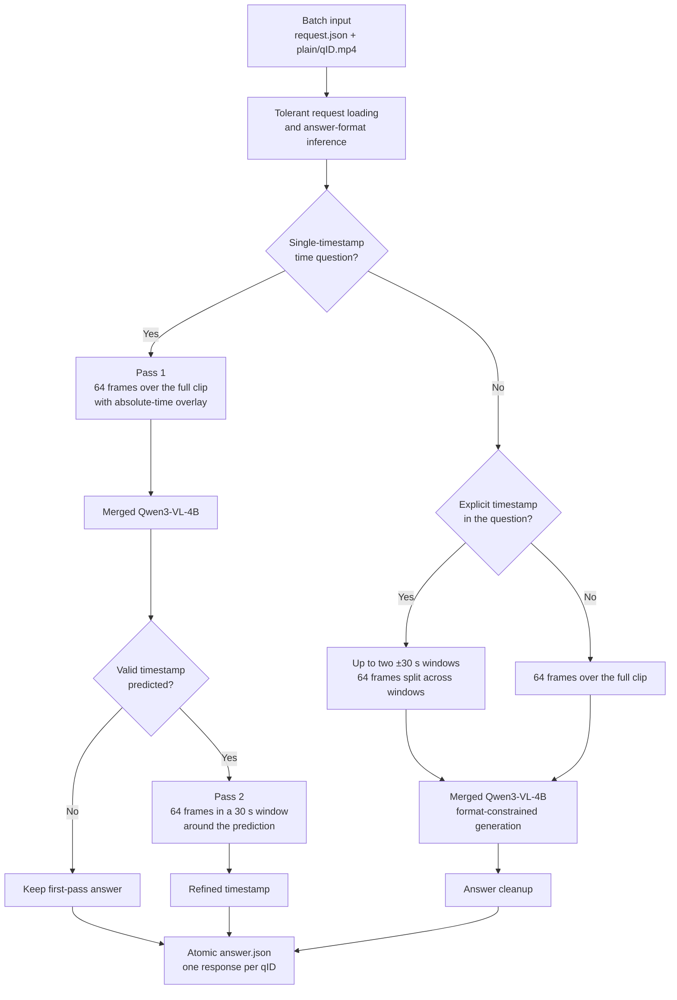

# DISCOVR-SEGMENT

Public release of **DISCOVR-SEGMENT**, submitted to the ORena SAVE FOCUS 2026
SEGMENT track by team **Incision Impossible**.

This repository contains the exact inference source recovered from the selected
container, together with reproducible weight-download, verification, Docker
build, test, and export commands. Large merged model weights are hosted
separately on Hugging Face.

## Selected challenge submission

| Field | Value |
|---|---|
| Public algorithm name | `DISCOVR-SEGMENT` |
| Grand Challenge algorithm | `DISCOVER SEGMENT T1` |
| Method ID | `8c0c5a0a-e147-486b-90c8-abbf0afeb624` |
| Image version | `b74f595d-06d4-488a-b76b-217544cf8e55` |
| Evaluation ID | `0b0b5564-a3e2-43f3-aa8e-a34fc3e485c9` |
| Pre-evaluation score | `0.5656564984886887` |
| Forfeited / unanswered | `0 / 0` |

## Method at a glance

DISCOVR-SEGMENT uses a merged `Qwen/Qwen3-VL-4B-Instruct` model fine-tuned for
surgical foreign-object visual question answering. Its routing changes where
the fixed frame budget is spent without adding an external detector or service.



Shared processing includes absolute timestamp overlays for temporal questions,
question-derived answer formats, a bundled surgical knowledge prompt, and
defensive batch I/O. See [METHOD.md](METHOD.md) for the complete routing,
training, and runtime description.

## Weights

The exact merged checkpoint is public at:

`https://huggingface.co/Div97/orena-focus-segment-fullvis-w64`

Download it into the expected container path:

```bash
python -m pip install huggingface_hub
python scripts/download_weights.py
python scripts/verify_release.py
```

The expected `model.safetensors` SHA-256 is:

```text
622fd66547b2ad88f9fcf9c74a22450f44b4c88cef8fcf1a9b464de2a51dcff3
```

The download script pins Hugging Face revision
`ab709ec95ab4c5cc73eb97664191a8f8d76cc59a`.

## Build

Docker with the NVIDIA runtime is required for the full smoke test.

```bash
python scripts/download_weights.py
python scripts/verify_release.py
./do_build.sh
./do_save.sh
```

`do_save.sh` creates the uploadable `segment-algorithm_*.tar.gz` archive.
To run `./do_test_run.sh`, first provide a compatible Grand Challenge fixture
under `test/input/interface_1/`. The original fixture is intentionally not
redistributed because challenge videos and annotations are not part of this
source release.

## Included release scripts

- `scripts/download_weights.py` downloads the exact checkpoint at its pinned
  Hugging Face revision.
- `scripts/verify_release.py` verifies the recovered source and model SHA-256
  values.
- `do_build.sh` validates that the checkpoint is present and builds the
  `linux/amd64` challenge image.
- `do_test_run.sh` runs the image offline with the NVIDIA runtime and checks
  that `answer.json` contains exactly one response per request.
- `do_save.sh` rebuilds and exports the uploadable Docker archive.

## Reproducibility and provenance

See [TRAINING.md](TRAINING.md) and
[provenance/release.json](provenance/release.json). The source hashes in the
manifest were measured directly from the selected OCI image, not from the later
experimental working tree.

## Data and safety

No patient videos, challenge cases, credentials, or raw challenge annotations
are included. Users must obtain datasets under their original terms. This is a
research challenge system and is not a medical device or a clinical decision
support product.

## License

Code is released under Apache-2.0. The base Qwen3-VL model is also distributed
under Apache-2.0. Dataset licenses and terms remain with their respective
owners. See [NOTICE](NOTICE).
